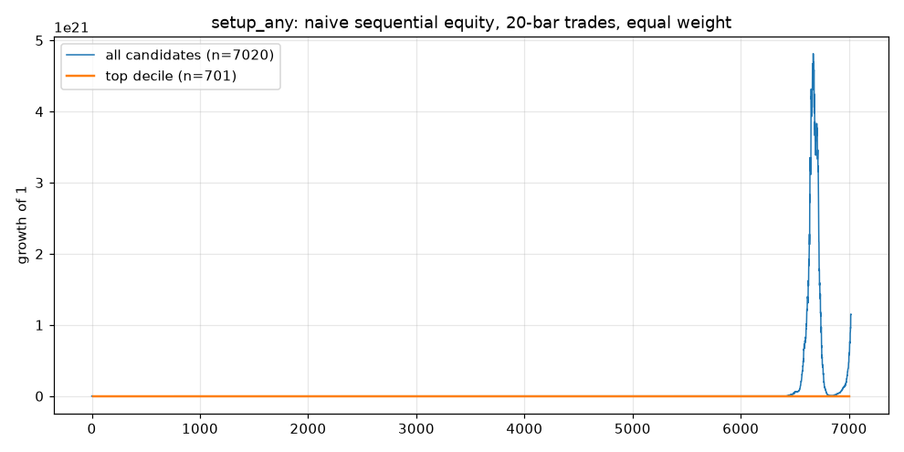
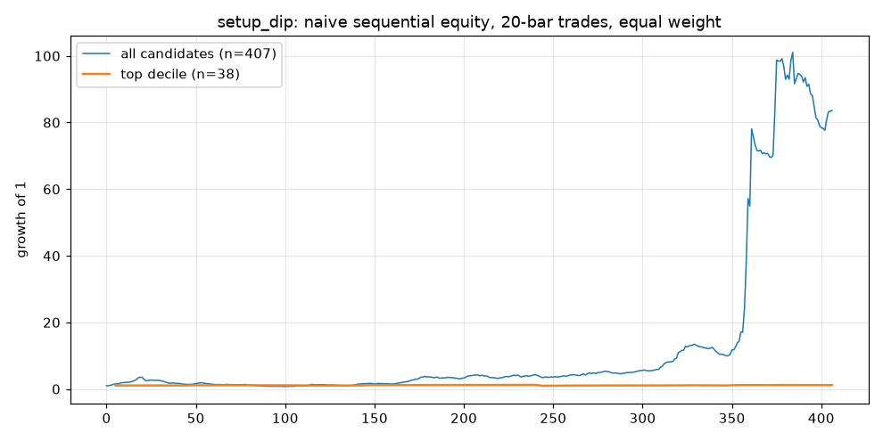
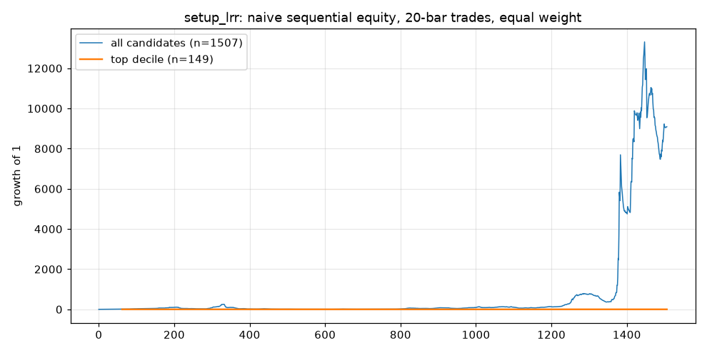

# ML Round 2 — Phase A walk-forward report (2026-09-07, run `phaseA_20260907_1035`)

Context: TrendSpider's ML Quant Lab Round 1 ended 24 models / 0 passes (docs/TRENDSPIDER_ML_ROUND1_RESULTS.md); its two usable lessons — MFR features out-rank RSI with TREND-line distance #1, and the fixed TP-before-SL target is the wrong question — set this phase's design. Regime data (FRED Quad, CBOE vol) is Phase B (docs/ROUND2_DATA_ROADMAP.md).

**What the model is for**: a RANKER of rule-generated candidates — the process rules decide what is even considerable; the model orders those bars by expected regime-normalized forward return (`fwd_sharpe_20`). It is not a signal generator.

Method notes: expanding yearly walk-forward (test 2021–2026 YTD), 30-bar purge per ticker at every boundary, never shuffled. Training target winsorized at ±5 (COVID-era rv20 tails); ALL evaluation is against raw values. `rp` here is bar D's own close vs range D at 16:00 ET — distinct from the exported `#MFR_*_RP` (prior close, 09:30); see ml/README.md. The shuffled-target LightGBM is refit per fold; read every number relative to it.

## Candidate sets

| set | definition | rows |
|---|---|---|
| setup_any | every bar with a defined rp (control) | 10039 |
| setup_lrr | above_trend==1 AND rp<0.45 (primary) | 1950 |
| setup_dip | setup_lrr AND decel_streak>=1 | 636 |

setup_lrr by ticker × year:

| ticker | 2018 | 2019 | 2020 | 2021 | 2022 | 2023 | 2024 | 2025 | 2026 | total |
|---|---|---|---|---|---|---|---|---|---|---|
| SPY | 0 | 62 | 41 | 58 | 26 | 80 | 80 | 51 | 47 | 445 |
| TLT | 3 | 72 | 30 | 55 | 26 | 58 | 61 | 81 | 43 | 429 |
| USO | 0 | 50 | 47 | 66 | 40 | 56 | 74 | 39 | 27 | 399 |
| UUP | 12 | 86 | 18 | 91 | 59 | 45 | 57 | 53 | 50 | 471 |
| AAAU | 0 | 0 | 0 | 0 | 15 | 72 | 73 | 41 | 5 | 206 |

## Fold metrics (per test year)

### setup_any

| year | model | n_test | IC | AUC | top-dec mean | top-dec hit | base mean | base hit |
|---|---|---|---|---|---|---|---|---|
| 2021 | lgbm_reg | 1260 | -0.061 | 0.454 | 1.7% | 69.8% | 1.2% | 61.5% |
| 2021 | lgbm_cls | 1260 | -0.047 | 0.486 | 1.2% | 61.9% | 1.2% | 61.5% |
| 2021 | logit | 1260 | -0.090 | 0.478 | 1.5% | 73.8% | 1.2% | 61.5% |
| 2021 | random | 1260 | 0.019 | 0.481 | 1.9% | 59.5% | 1.2% | 61.5% |
| 2022 | lgbm_reg | 1255 | -0.209 | 0.390 | -3.0% | 19.2% | -0.1% | 47.1% |
| 2022 | lgbm_cls | 1255 | -0.138 | 0.436 | -2.0% | 30.4% | -0.1% | 47.1% |
| 2022 | logit | 1255 | -0.136 | 0.452 | -0.6% | 41.6% | -0.1% | 47.1% |
| 2022 | random | 1255 | 0.012 | 0.516 | 0.1% | 52.0% | -0.1% | 47.1% |
| 2023 | lgbm_reg | 1250 | -0.024 | 0.501 | -0.2% | 47.2% | 0.4% | 52.2% |
| 2023 | lgbm_cls | 1250 | 0.023 | 0.524 | 0.3% | 64.0% | 0.4% | 52.2% |
| 2023 | logit | 1250 | 0.031 | 0.519 | 0.2% | 47.2% | 0.4% | 52.2% |
| 2023 | random | 1250 | 0.028 | 0.513 | 0.5% | 52.0% | 0.4% | 52.2% |
| 2024 | lgbm_reg | 1260 | 0.247 | 0.607 | 1.6% | 73.8% | 1.1% | 62.1% |
| 2024 | lgbm_cls | 1260 | 0.197 | 0.605 | 2.1% | 81.0% | 1.1% | 62.1% |
| 2024 | logit | 1260 | 0.214 | 0.623 | 2.2% | 81.0% | 1.1% | 62.1% |
| 2024 | random | 1260 | -0.012 | 0.491 | 1.2% | 64.3% | 1.1% | 62.1% |
| 2025 | lgbm_reg | 1250 | 0.118 | 0.578 | 1.7% | 62.4% | 1.0% | 55.6% |
| 2025 | lgbm_cls | 1250 | 0.059 | 0.550 | 2.8% | 64.8% | 1.0% | 55.6% |
| 2025 | logit | 1250 | 0.215 | 0.627 | 1.1% | 54.4% | 1.0% | 55.6% |
| 2025 | random | 1250 | -0.003 | 0.494 | 1.9% | 61.6% | 1.0% | 55.6% |
| 2026 | lgbm_reg | 745 | -0.096 | 0.467 | -0.5% | 47.3% | 2.1% | 53.6% |
| 2026 | lgbm_cls | 745 | -0.048 | 0.495 | -0.5% | 45.9% | 2.1% | 53.6% |
| 2026 | logit | 745 | -0.044 | 0.485 | 0.3% | 51.4% | 2.1% | 53.6% |
| 2026 | random | 745 | -0.017 | 0.509 | 3.1% | 52.7% | 2.1% | 53.6% |

### setup_lrr

| year | model | n_test | IC | AUC | top-dec mean | top-dec hit | base mean | base hit |
|---|---|---|---|---|---|---|---|---|
| 2021 | lgbm_reg | 270 | 0.060 | 0.483 | -1.6% | 48.1% | 1.3% | 64.8% |
| 2021 | lgbm_cls | 270 | 0.045 | 0.486 | 0.6% | 70.4% | 1.3% | 64.8% |
| 2021 | logit | 270 | 0.005 | 0.488 | 1.3% | 74.1% | 1.3% | 64.8% |
| 2021 | random | 270 | -0.018 | 0.540 | 0.5% | 63.0% | 1.3% | 64.8% |
| 2022 | lgbm_reg | 166 | -0.334 | 0.297 | -0.1% | 43.8% | 0.3% | 54.2% |
| 2022 | lgbm_cls | 166 | -0.345 | 0.313 | -2.0% | 31.2% | 0.3% | 54.2% |
| 2022 | logit | 166 | -0.266 | 0.333 | -1.7% | 31.2% | 0.3% | 54.2% |
| 2022 | random | 166 | -0.170 | 0.399 | -3.4% | 25.0% | 0.3% | 54.2% |
| 2023 | lgbm_reg | 311 | -0.121 | 0.449 | -2.0% | 19.4% | -0.4% | 43.4% |
| 2023 | lgbm_cls | 311 | -0.031 | 0.484 | -1.1% | 32.3% | -0.4% | 43.4% |
| 2023 | logit | 311 | 0.167 | 0.582 | 0.8% | 48.4% | -0.4% | 43.4% |
| 2023 | random | 311 | -0.094 | 0.406 | -0.4% | 38.7% | -0.4% | 43.4% |
| 2024 | lgbm_reg | 345 | 0.086 | 0.580 | 1.6% | 73.5% | 0.9% | 56.5% |
| 2024 | lgbm_cls | 345 | 0.121 | 0.591 | 1.9% | 73.5% | 0.9% | 56.5% |
| 2024 | logit | 345 | 0.029 | 0.486 | 2.7% | 61.8% | 0.9% | 56.5% |
| 2024 | random | 345 | -0.116 | 0.466 | 0.0% | 52.9% | 0.9% | 56.5% |
| 2025 | lgbm_reg | 265 | 0.064 | 0.563 | -0.3% | 46.2% | 0.5% | 51.3% |
| 2025 | lgbm_cls | 265 | 0.007 | 0.535 | -0.4% | 42.3% | 0.5% | 51.3% |
| 2025 | logit | 265 | 0.059 | 0.588 | 2.6% | 88.5% | 0.5% | 51.3% |
| 2025 | random | 265 | 0.069 | 0.541 | -0.3% | 46.2% | 0.5% | 51.3% |
| 2026 | lgbm_reg | 150 | -0.123 | 0.503 | -0.0% | 53.3% | 2.6% | 47.3% |
| 2026 | lgbm_cls | 150 | 0.090 | 0.614 | 0.6% | 60.0% | 2.6% | 47.3% |
| 2026 | logit | 150 | -0.163 | 0.461 | 2.5% | 73.3% | 2.6% | 47.3% |
| 2026 | random | 150 | 0.145 | 0.567 | 1.1% | 60.0% | 2.6% | 47.3% |

### setup_dip

| year | model | n_test | IC | AUC | top-dec mean | top-dec hit | base mean | base hit |
|---|---|---|---|---|---|---|---|---|
| 2021 | — | 91 | skipped (n_train=20) | | | | | |
| 2022 | lgbm_reg | 53 | 0.183 | 0.519 | 2.2% | 60.0% | 1.4% | 58.5% |
| 2022 | lgbm_cls | 53 | 0.105 | 0.481 | 0.3% | 40.0% | 1.4% | 58.5% |
| 2022 | logit | 53 | -0.307 | 0.258 | -1.5% | 20.0% | 1.4% | 58.5% |
| 2022 | random | 53 | 0.201 | 0.575 | 2.2% | 80.0% | 1.4% | 58.5% |
| 2023 | lgbm_reg | 98 | 0.099 | 0.556 | 0.5% | 66.7% | -0.1% | 44.9% |
| 2023 | lgbm_cls | 98 | 0.076 | 0.560 | -0.9% | 55.6% | -0.1% | 44.9% |
| 2023 | logit | 98 | 0.156 | 0.649 | -0.0% | 55.6% | -0.1% | 44.9% |
| 2023 | random | 98 | -0.171 | 0.447 | -2.7% | 22.2% | -0.1% | 44.9% |
| 2024 | lgbm_reg | 117 | 0.003 | 0.490 | -1.0% | 54.5% | 1.0% | 60.7% |
| 2024 | lgbm_cls | 117 | 0.038 | 0.510 | 0.4% | 54.5% | 1.0% | 60.7% |
| 2024 | logit | 117 | 0.104 | 0.547 | 1.0% | 63.6% | 1.0% | 60.7% |
| 2024 | random | 117 | 0.186 | 0.556 | 4.2% | 81.8% | 1.0% | 60.7% |
| 2025 | lgbm_reg | 82 | 0.126 | 0.604 | 0.4% | 75.0% | 1.1% | 57.3% |
| 2025 | lgbm_cls | 82 | 0.177 | 0.622 | 0.9% | 75.0% | 1.1% | 57.3% |
| 2025 | logit | 82 | 0.080 | 0.581 | 0.5% | 75.0% | 1.1% | 57.3% |
| 2025 | random | 82 | 0.090 | 0.524 | 1.1% | 62.5% | 1.1% | 57.3% |
| 2026 | lgbm_reg | 57 | -0.103 | 0.491 | 2.0% | 80.0% | 4.4% | 49.1% |
| 2026 | lgbm_cls | 57 | 0.032 | 0.554 | 2.6% | 100.0% | 4.4% | 49.1% |
| 2026 | logit | 57 | -0.082 | 0.488 | 0.3% | 40.0% | 4.4% | 49.1% |
| 2026 | random | 57 | -0.100 | 0.486 | 1.6% | 40.0% | 4.4% | 49.1% |

## Pass/fail (desk rule: top decile ≥ +5 pts hit edge AND IC>0 in ≥4 of 6 test years, random must fail)

- **setup_dip: PASS** — model hit edge 13.14 pts, IC>0 4/5; random 3.21 pts, IC>0 3/5
- **setup_lrr: FAIL** — model hit edge -5.56 pts, IC>0 3/6; random -5.31 pts, IC>0 2/6

## Dip flag as a SUBSET of the LRR model

Inside setup_lrr's own out-of-sample predictions, rows with decel_streak>=1 (n=498): mean fwd_ret_20 1.35% / hit 56.4% vs all LRR candidates 0.75% / 53.2%.

## Per-ticker IC (lgbm_reg, pooled test years)

- setup_any: AAAU 0.0527 (n=1405), SPY -0.1227 (n=1403), TLT 0.0163 (n=1405), USO -0.0056 (n=1404), UUP -0.0755 (n=1403)
- setup_dip: AAAU -0.0238 (n=64), SPY 0.1854 (n=69), TLT -0.0061 (n=102), USO -0.1278 (n=84), UUP -0.0629 (n=88)
- setup_lrr: AAAU -0.1954 (n=201), SPY -0.0855 (n=332), TLT -0.0439 (n=324), USO -0.162 (n=298), UUP -0.1522 (n=352)

## Feature importance (LightGBM gain, top 10 of the final fold)

- setup_any (2026): rv20 102098, hurst256 92395, corr30_spy 78126, trend_dist 73999, hurst64 61684, corr30_uup 61419, vix_level 56367, trade_dist 48124, volatility 46221, bulldist 46090
- setup_dip (2026): corr30_spy 4633, bulldist 4102, hurst256 3813, hurst64 3545, rv20 3532, vix_level 3473, hyg_roc10 3242, trade_dist 2797, corr30_uup 2761, trend_dist 2277
- setup_lrr (2026): hurst256 23524, rv20 19665, corr30_spy 15397, bulldist 14030, hurst64 13602, trend_dist 11548, vix_level 11312, corr30_uup 10786, trade_dist 9380, rng_width 8492

## Equity curves

Naive sequential compounding of each selected 20-bar trade (equal weight, overlaps ignored) — comparative shape only, not a backtest.

## Standing notes
- `mega_buy` fired 0/88 within ±3 bars of the old strict dip rule: the indicator's buy logic is a different animal (capitulation/breakout). It stays as a feature; no reconciliation attempted.
- `rr_hit_5_2p5_30` is the Round-1 continuity check only. UUP's 4.0% base rate is the Round-1 lesson (fixed 5% TP unreachable inside dollar-ETF ranges); no conclusions drawn from it.
- TLT rows are `tv_unverified` (indicator-only, the 2026-09-06 waiver).